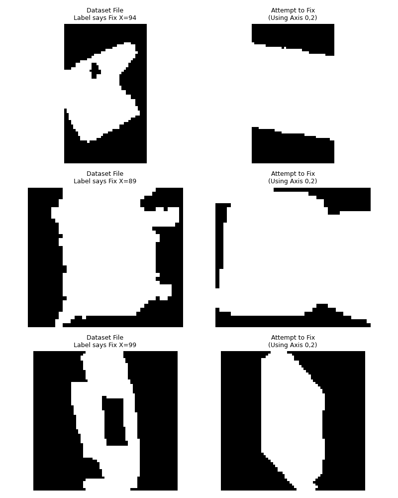
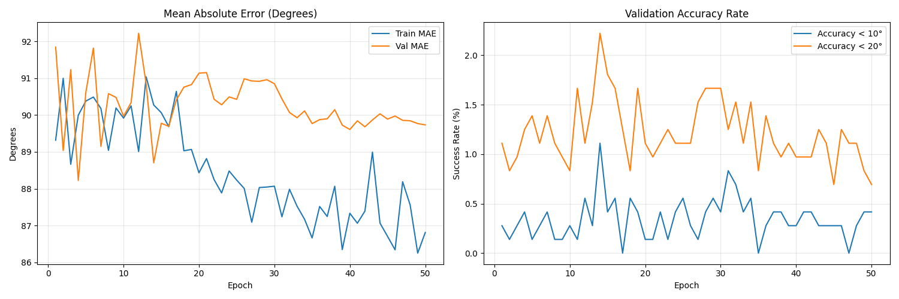

# What is going on

we started with the place where we have gotten to so far. the gold dataset is the one that we have generated so that the previous issues are fixed.

# Issue 01:
we trainign it on the pre trained weights. didn't work. around 90 degree error.

# fix 01:
auditing the dataset. 

# Issue 02: 
I didnot include the names of the models taht were used for testing. cant see what the hell is it. 

# Fix 02: 
named auditing is done. 

# Issue 03:
the models are too confuding so i cheesed a specific one and asked it to apply the rortations. 

# fix 03:
so the dataste is correct it seems now, the only issue that i can see is the model. the reason is that i am using the weights of the pretrained model which was on video data. what i am going to do is revert back to the old model which is based on the resnet18 but no weights. 

the final results:

---
# possible theory
let's start from the start. we are using a CNN for a 3d models. and according to "Eranpurwala, A., Ghiasian, S. E., & Lewis, K. (2020). Predicting build orientation of additively manufactured parts with me chanical machining features using deep learning. In Proceed ings of the ASME 2020 IDETC/CIE Conference."

"""
The researchers developed a data-driven predictive model that maps standard machining features to optimal build orientation angles in Additive Manufacturing (AM). The primary goal was to create a method that is faster and more efficient than traditional algorithms, which are often computationally expensive or require human intervention to make tradeoffs between multiple alternative orientations.
Their methodology consists of several key phases:
1. Data Preparation and Voxelization
The framework uses 3D models in standard tessellated language (STL) format as input. These are converted into voxelized models—discrete 3D grid representations—using a tool called binvox with a resolution of 64x64x64. Voxelization allows the system to keep geometric and topological information while simplifying the data for neural network processing.
2. Machining Feature Recognition (Classification)
To recognize specific geometries, the researchers utilized a nine-layer 3D Convolutional Neural Network (CNN).
• Training Set: The network was trained on 54,000 voxelized files representing 18 standard machining features (such as holes, slots, pockets, chamfers, and fillets) obtained from the FeatureNet dataset.
• Rotation Augmentation: Each feature was trained in six different directions to ensure the model could recognize them regardless of their axis.
• Multi-Feature Segmentation: For parts with multiple features, the researchers implemented a watershed segmentation algorithm and connected component labeling to partition the object into individual features before passing them through the trained 3D-CNN for classification.
3. Orientation Evaluation for Training
Simultaneously, the researchers conducted an exhaustive evaluation on a multi-feature dataset of 1,000 parts to find their "true" optimal orientations to use as training labels.
• Quaternion Rotations: Each part was rotated around the x- and y-axes using quaternions in 5° increments from 0° to 360°.
• Optimization Criterion: For every rotation, the volume of required support structures was calculated. The orientation that yielded the minimum support structure volume was identified as the optimal build orientation.
4. Multi-Target Regression Analysis
The final step was to link the recognized features to the optimal angles using a Random Forest Regressor.
• Mapping: The regressor was trained to establish a relationship where the predictor variables are the types and counts of machining features on a part, and the target variables are the x- and y- orientation angles.
• Advantages: This approach allows the system to predict the best build angle for a new, unseen part instantly based on its features, bypassing the need for time-consuming rotations or complex simulations.
The researchers validated this method using two specific test cases, finding that the predicted orientation angles had an error of less than 1% compared to those found through exhaustive search

"""